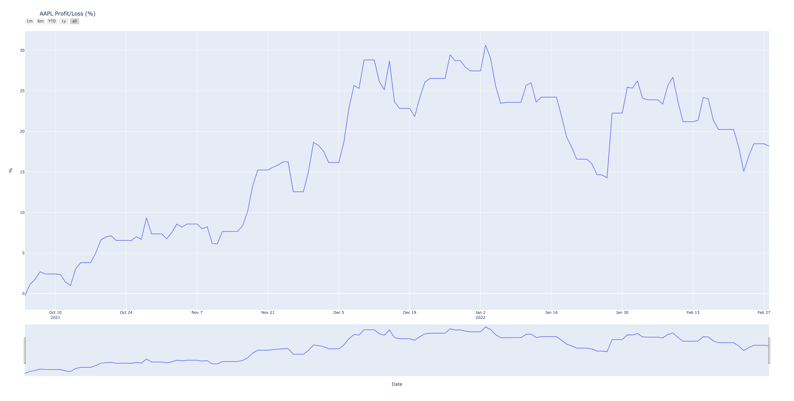
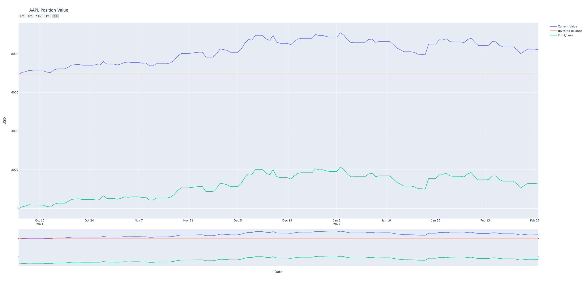
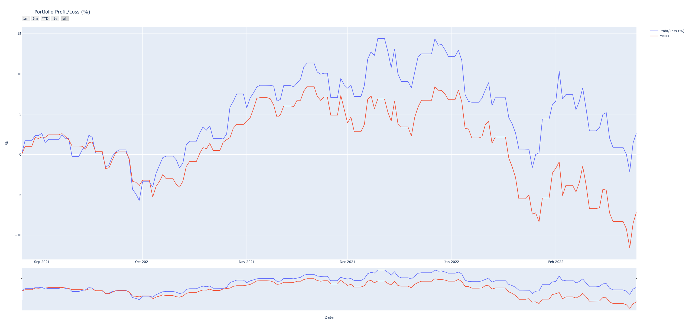
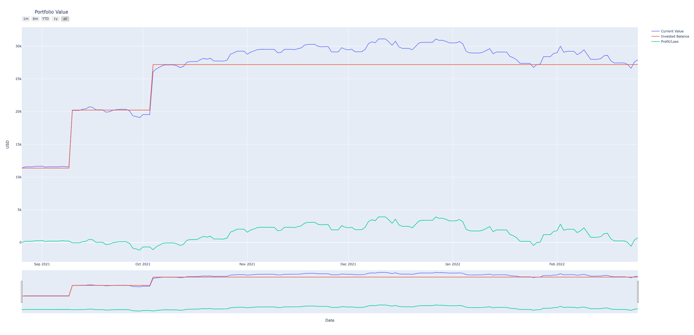

# TinyPortfolioTracker

## Legal note

Yahoo!, Y!Finance, and Yahoo! finance are registered trademarks of Yahoo, Inc.

tinyportfoliotracker is not affiliated, endorsed, or vetted by Yahoo, Inc. It's an open-source tool that uses Yahoo's publicly available APIs, and is intended for research and educational purposes.

You should refer to Yahoo!'s terms of use for details on your rights to use the actual data downloaded.

## Note(2)
None of the graphs here are coming from real investments, I just made up some test data in a bogus portfolio on Yahoo!Finance ;)

## Introduction
TinyPortfolioTracker is a small set of libraries that lets you track your portfolio performance by simply exporting your portfolio that you find [here](https://finance.yahoo.com/portfolio/p_0/view) by clicking on the top right corner "Export" button.


It retrieves Yahoo!Finance data using `pandas-datareader` and tries to keep things small and simple offering a pythonic interface to interacting with your portfolio.

## Usage

Import the needed classes from `yportfolio` module and load your positions from the CSV file you exported:
```python
from yportfolio import YahooCsv, Position, Portfolio

positions = YahooCsv("your_quotes.csv").load()
portfolio = Portfolio(positions)
```
### Positions
You will have `positions` which is a simple list containing all your positions, with their historical prices.
```python
In [3]: positions
Out[3]: 
[Position(MSFT),
 Position(AAPL)]
```
You can interact with each of these, discovering their current price, how much you have invested in them and how many shares you own. Most importantly you can plot the Profit/Loss (`position.plot_profit_loss()`)


...and their Value graph (`position.plot_value()`).


### Portfolio
You will also have access to the aggregate portfolio value (`portfolio.current_value`) and its allocation among the different positions (`portfolio.allocation`). And as you do with each position you will have a chance to plot the Profit/Loss (`portfolio.plot_profit_loss()`) 



and its Value graph (`portfolio.plot_value()`).



# Caveats
 * This was a quick exercise and besides a bit of caching I have not added anything fancy
 * Logging is non existent
 * Testing has not been done, but if you end up using it and find bugs please report them here ;)


